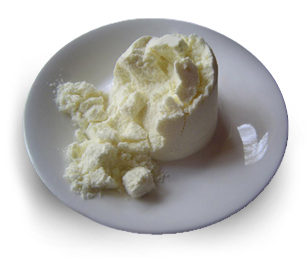

### Principle:
&nbsp;
Milk is a mixture of many types of proteins, most of them present in very small amounts. Milk proteins are classified into three main groups of proteins on the basis of their widely different behaviors and forms of existence. They are caseins (80%), whey proteins and minor proteins. Casein is a heterogeneous mixture of phosphorous containing proteins in milk. Casein is present in milk as calcium salt and calcium caseinate. It is a mixture of alpha, beta and kappa caseins to form a cluster called micelle. These micelles are responsible for the white opaque appearance of milk.
 
 &nbsp;

 &nbsp;
 
 Casein, like proteins, are made up of many hundreds of individual amino acids.   Each  may have a positive or a negative charge, depending on the pH of the [milk] system. At some pH value, all the positive charges and all the negative charges on the [casein] protein will be in balance, so that the net charge on the protein will be zero.

&nbsp;

  That pH value is known as the isoelectric point (IEP) of the protein and is generally the pH at which the protein is least soluble. For casein, the IEP is approximately 4.6 and it is the pH value at which acid casein is precipitated. In milk, which has a pH of about 6.6, the casein micelles have a net negative charge and are quite stable. During the addition of acid to milk, the negative charges on the outer surface of the micelle are neutralized (the phosphate groups are protonated), and the neutral protein precipitates. 

&nbsp;

The same principle applies when milk is fermented to curd. The lactic acid bacillus produces lactic acid as the major metabolic end-product of carbohydrate [lactose in milk] fermentation. The lactic acid production lowers the  the pH of  milk to the IEP of casein. At this pH, casein precipitates.
